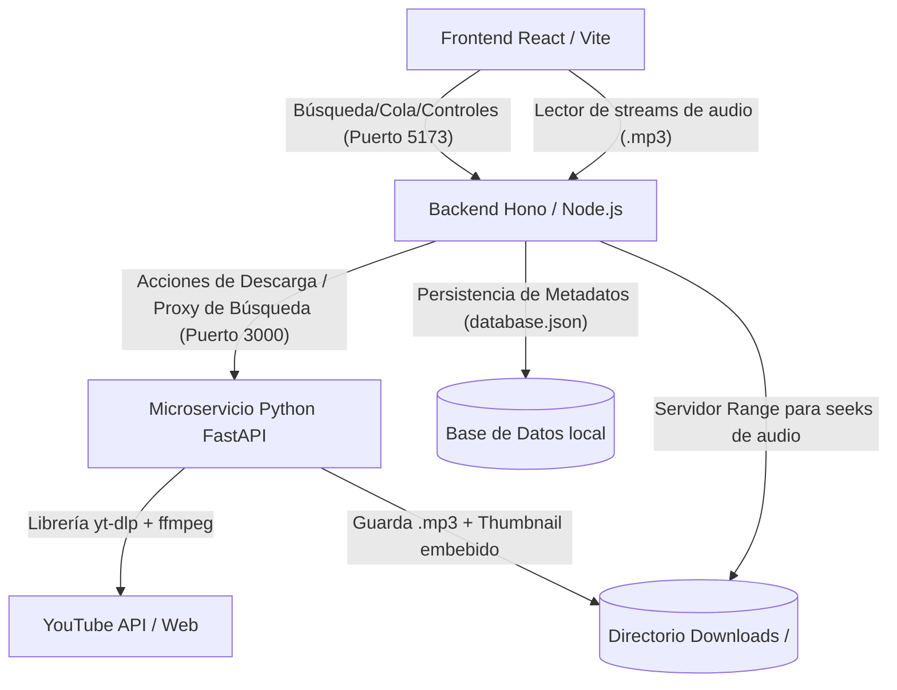

# Omniplayer: Spotify Clone - Omnitrix Edition 🛸🎧

Omniplayer es un clon moderno de Spotify diseñado con una estética futurista basada en el **Omnitrix** de Ben 10. Cuenta con un buscador integrado de música de YouTube, descarga directa de audio a MP3 de alta calidad y un reproductor local interactivo que soporta múltiples skins y control de deslizamiento (seeking).

---

## 🏗️ Arquitectura del Sistema

El proyecto está diseñado bajo una arquitectura desacoplada de microservicios locales para aprovechar la eficiencia de cada tecnología en su área específica:



### 1. Frontend: React + Vite + TypeScript (Puerto 5173)
*   **Estética Omnitrix Sci-Fi Premium**: Fondo oscuro profundo con acentos de neón brillante, bordes con efecto cristal (glassmorphism), y un dial interactivo del Omnitrix diseñado en SVG dinámico.
*   **Selector de Skin (Temas del Dial)**: Al hacer clic en el Omnitrix, la interfaz cambia su color a 4 temas míticos de la serie:
    *   **Classic Green**: El Omnitrix tradicional de Ben.
    *   **Albedo Red**: Estilo del Omnitrix negativo/Albedo.
    *   **Ultimate Blue**: Inspirado en el Ultimatrix / modo holograma azul.
    *   **Mad Ben Gold**: Estilo bélico dorado postapocalíptico.
*   **Controles de Audio Interactivos**: Control de volumen, mute, modo aleatorio, repetición de pistas, cola de reproducción y barra de tiempo interactiva.
*   **Integración Web Media Session**: Enlaza los controles físicos del teclado, notificaciones del sistema de tu OS y pantallas de bloqueo móvil con la pista que se está reproduciendo.
*   **Ecualizador Visualizador Dinámico**: Columnas de audio animadas con neón que vibran al ritmo del play/pause.

### 2. Backend Hono: TypeScript / Node.js (Puerto 3000)
*   **API Gateway**: Recibe las consultas del cliente React y las enruta apropiadamente.
*   **Local Library Database**: Mantiene una base de datos indexada (`database.json`) para acelerar la carga de metadatos de las canciones descargadas (evitando lecturas redundantes del disco).
*   **Servidor de Audio con Soporte HTTP Range**: Implementación personalizada de streaming de archivos que analiza la cabecera `Range` del navegador. Esto es crítico en reproductores multimedia para que el usuario pueda saltar/adelantar partes de la canción libremente sin descargar todo el archivo de nuevo.

### 3. API Downloader: Python 3 + FastAPI + yt-dlp (Puerto 8000)
*   **Buscador Integrado sin Claves**: Usa el motor interno de `yt-dlp` para realizar búsquedas en YouTube mediante `ytsearch` devolviendo directamente listados estructurados con título, artista, duración y portada en milisegundos.
*   **Pipeline de Descarga y Procesamiento**:
    *   Descarga el flujo de mejor audio disponible.
    *   Lo extrae a formato **MP3 a 192kbps** (calidad óptima estéreo).
    *   Descarga la miniatura de portada en alta calidad.
    *   **Inyección ID3**: Embebe la carátula, introduce los tags ID3 de título y artista creador directamente en el archivo MP3 (usando metadatos de ffmpeg).
*   **FFmpeg Portable**: Se autogestiona usando binarios estáticos descargados localmente en `./bin/`, permitiendo funcionar en el sistema sin necesidad de permisos de administrador o instalaciones manuales de dependencias de sistema.

---

## 📂 Directorios del Proyecto

*   `./bin/`: Contiene los ejecutables estáticos de `ffmpeg` y `ffprobe`.
*   `./downloads/`: Carpeta compartida donde se almacenan las pistas de música descargadas en formato `.mp3`.
*   `./frontend/`: Proyecto React con Vite, TypeScript y estilos personalizados en CSS.
*   `./backend-hono/`: Servidor Hono con tsx, tipos y configuración CORS.
*   `./backend-python/`: Código de FastAPI con entorno virtual configurado en `venv/`.
*   `./start.sh`: Script bash de orquestación general.

---

## 🚀 Cómo Ejecutar el Proyecto

Puedes iniciar todos los servidores de manera simultánea con un único comando utilizando el script de inicio integrado.

### Prerrequisitos
*   Tener **Node.js** (versión v18+) instalado en el sistema.
*   Tener **Python 3** instalado en el sistema.

### Instrucciones de Inicio

1.  **Abre una terminal** en la carpeta raíz del proyecto (`/home/edu/Dev/Omniplayer`).
2.  **Dale permisos de ejecución al script** (ya configurado, pero por seguridad):
    ```bash
    chmod +x start.sh
    ```
3.  **Inicia la aplicación**:
    ```bash
    ./start.sh
    ```
4.  **Abre tu navegador en**:
    *   **Frontend**: [http://localhost:5173](http://localhost:5173) (Aquí está el reproductor principal)
    *   **API Hono**: [http://localhost:3000](http://localhost:3000)
    *   **FastAPI Python**: [http://localhost:8000/docs](http://localhost:8000/docs) (Swagger UI interactiva)

5.  Para detener todos los servidores simultáneamente de manera segura, pulsa `Ctrl+C` en la terminal donde se ejecuta el script `start.sh`.

---

## 💡 Detalles de Implementación Destacados

*   **Offline First**: Una vez descargada una canción, toda la reproducción de la misma y su carátula se extraen localmente desde el servidor de Hono, permitiendo que el Omniplayer funcione sin conexión a internet para las pistas existentes.
*   **Modularidad limpia**: Si en el futuro deseas migrar el servidor de descargas a otra máquina u host, solo necesitas cambiar la dirección en `backend-hono/src/index.ts` sin tocar el código del frontend.
