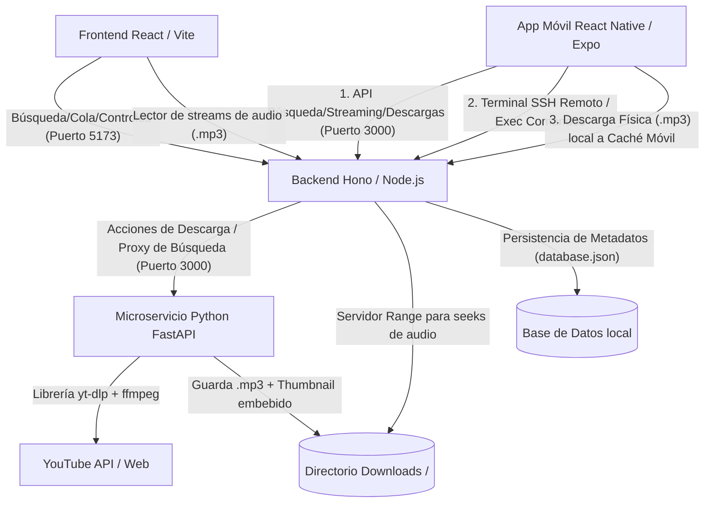

# Omniplayer: Spotify Clone - Omnitrix Edition 🛸🎧

Omniplayer es un reproductor de música inteligente y clon de Spotify diseñado con una estética premium futurista basada en el **Omnitrix** de Ben 10. Cuenta con un buscador integrado de YouTube, descarga directa de audio a MP3 de alta calidad y reproductores dedicados para la **Web** (React + Vite) y para **Móvil Android** (React Native + Expo) que soportan skins, control de deslizamiento (seeking) y almacenamiento local con modo offline.

---

## 🏗️ Arquitectura del Sistema

El proyecto está diseñado bajo una arquitectura desacoplada de microservicios locales para aprovechar la eficiencia de cada tecnología en su área específica:



### 1. Frontend Web: React + Vite + TypeScript (Puerto 5173)
*   **Estética Omnitrix Sci-Fi Y2K**: Fondo oscuro profundo con acentos de neón brillante, bordes con efecto cristal (glassmorphism), y un dial interactivo del Omnitrix diseñado en SVG dinámico.
*   **Selector de Skin (Temas)**: La interfaz cambia su color a 4 temas míticos de la serie:
    *   *Classic Green*: El Omnitrix tradicional de Ben.
    *   *Albedo Red*: Estilo del Omnitrix negativo/Albedo.
    *   *Ultimate Blue*: Inspirado en el Ultimatrix.
    *   *Mad Ben Gold*: Estilo bélico dorado postapocalíptico.
*   **Ecualizador Visualizador Dinámico**: Columnas de audio animadas con neón que vibran al ritmo del play/pause.

### 2. App Móvil: React Native + Expo (Puerto 8081)
*   **Reproducción Remota y Offline Inteligente**:
    *   *Modo Online*: Transmite canciones desde YouTube a través de la PC o reproduce archivos que ya están descargados en el servidor Hono mediante streaming directo.
    *   *Modo Offline*: Permite descargar canciones físicas (`.mp3`) directamente al dispositivo móvil (usando `expo-file-system`) y reproducirlas localmente sin conexión de red (usando `expo-av`), atenuando de forma inteligente las pistas remotas no disponibles.
*   **Consola SSH Remota**: Una terminal verde neón retro estilo CLI integrada en la pestaña de Ajustes que permite ejecutar comandos seguros directamente en la consola del PC servidor en tiempo real.
*   **Controles Simplificados y Taller Player**: Reproductor inferior más alto con controles directos (Play/Pause, Favorito/Like y Añadir a Playlist) delegando el volumen al sistema de botones físicos del móvil.
*   **Compatibilidad Node v18**: Metro Bundler está configurado con un polyfill precargado (`polyfill.js`) que inyecta clases modernas y métodos ES2023 (`Array.prototype.toReversed`, etc.), asegurando un inicio exitoso del entorno móvil en Node v18.

### 3. Backend Gateway Hono: Node.js (Puerto 3000)
*   **API Gateway & SSH Execute**: Maneja la persistencia de metadatos (`database.json`), sirve las canciones y posee el endpoint seguro `/api/ssh/execute` para despachar comandos al shell del sistema local de la PC.
*   **Servidor de Audio con HTTP Range**: Streaming optimizado de archivos que analiza la cabecera `Range`, permitiendo seeks/adelantos instantáneos de canciones en los reproductores.

### 4. API Downloader: Python 3 + FastAPI + yt-dlp (Puerto 8000)
*   **Buscador Integrado sin Claves**: Usa el motor interno de `yt-dlp` para realizar búsquedas rápidas en YouTube mediante `ytsearch`.
*   **Pipeline de Procesamiento**: Descarga audio, lo convierte a **MP3 a 192kbps**, y realiza inyección de metadatos ID3 (título, artista y portada embebida en el archivo de audio) mediante FFmpeg estático autogestionado en `./bin/`.

---

## 📂 Directorios del Proyecto

*   `./bin/`: Contiene los ejecutables estáticos de `ffmpeg` y `ffprobe`.
*   `./downloads/`: Directorio compartido donde se almacenan las canciones descargadas en formato `.mp3`.
*   `./frontend/`: Proyecto Web React con Vite y TypeScript.
*   `./backend-hono/`: Servidor Hono TypeScript/Node.js de control principal.
*   `./backend-python/`: Servicio Downloader en Python FastAPI con su entorno virtual.
*   `./mobile/`: Proyecto móvil React Native desarrollado con Expo SDK 54.
*   `./polyfill.js`: Script de compatibilidad para ejecutar Expo Metro CLI en Node v18.
*   `./start.sh`: Script bash de orquestación general de los servicios del PC.

---

## 🚀 Cómo Ejecutar el Proyecto

### 1. Iniciar los Servicios en la PC (Servidor)
Prerrequisitos: Tener instalado Node.js (v18+) y Python 3 en tu sistema de desarrollo.

1.  **Abre una terminal** en la carpeta raíz del proyecto (`/home/edu/Dev/Omniplayer`).
2.  **Dale permisos de ejecución al script** si no los tiene:
    ```bash
    chmod +x start.sh
    ```
3.  **Inicia la aplicación**:
    ```bash
    ./start.sh
    ```
    *Esto iniciará la base de datos, el backend Hono (puerto 3000), el microservicio Python (puerto 8000) y la app Web en el navegador (puerto 5173).*

### 2. Iniciar la Aplicación Móvil
1.  **Abre otra terminal** en el subdirectorio `./mobile`.
2.  **Ejecuta el servidor de desarrollo Expo**:
    ```bash
    npm run start
    ```
3.  **Conecta tu móvil**:
    *   Asegúrate de tener instalada la app **Expo Go** en tu smartphone y que esté en la **misma red Wi-Fi** que la PC.
    *   Escanea el código QR generado en la terminal.
4.  **Enlazar con la PC**:
    *   En la app móvil, navega a **Ajustes** (pestaña inferior derecha).
    *   Coloca la IP local de tu ordenador en el campo de IP del Servidor (e.g. `192.168.1.76`).
    *   Ingresa las credenciales por defecto (`user` / `password` / puerto `22`) y presiona **"ENLAZAR SSH CON PC"**.
    *   ¡Listo! El indicador cambiará a **ONLINE** y se activará la consola interactiva.
